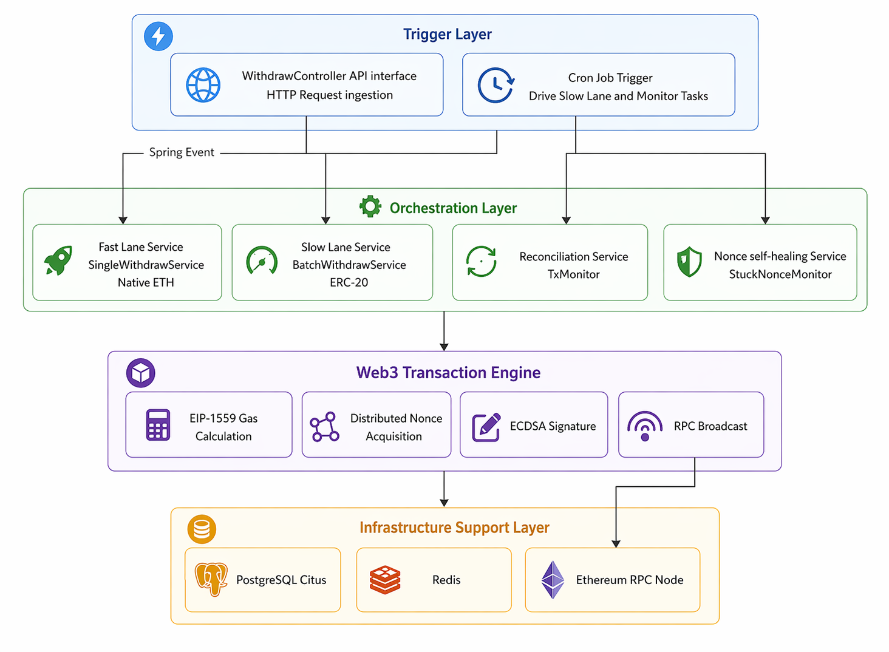
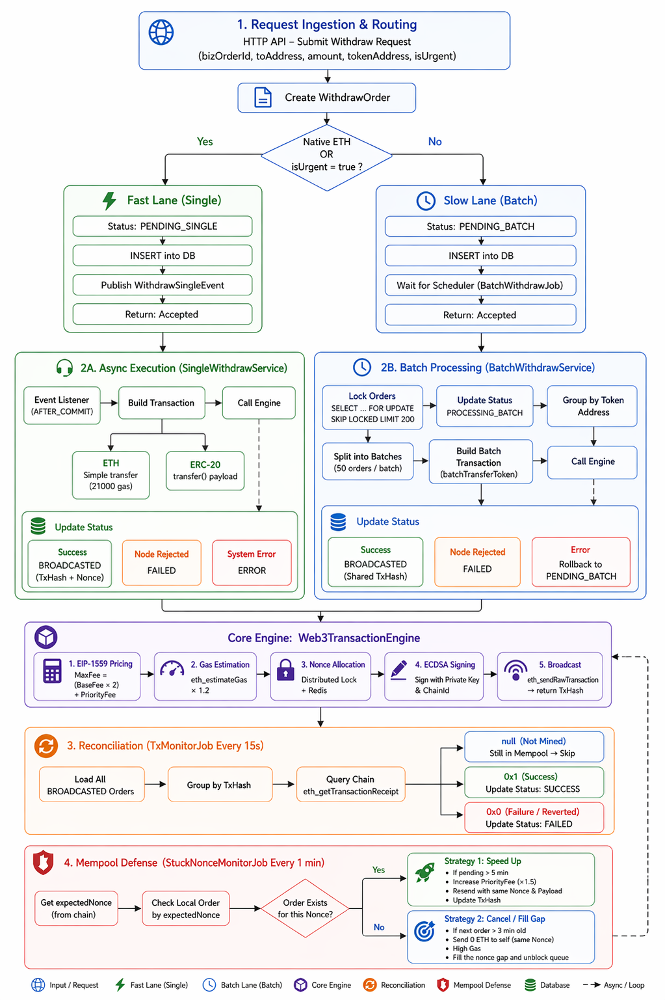

# 🛡️ tx-sentry: Enterprise-Grade Web3 Withdrawal Gateway

tx-sentry is an industrial-standard, highly concurrent Web3 clearing and settlement gateway. Designed to act as the core asset infrastructure for Centralized Exchanges (CEX) and custodial platforms, it handles native ETH and ERC-20 token withdrawals from an Omnibus Hot Wallet to the Ethereum network with extreme resilience and gas efficiency.

## 🌟 Core Architecture

tx-sentry strictly follows a **3-Tier Funnel Architecture** to decouple business logic from EVM complexities:

1. **Trigger Layer**: API Controllers and Spring `@Scheduled` Cron Jobs.
2. **Orchestration Layer**: `SingleWithdrawService` & `BatchWithdrawService`. Responsible for ABI encoding, chunking, and database short-transactions.
3. **Execution Engine Layer**: `Web3TransactionEngine`. A unified, stateless engine handling EIP-1559 dynamic pricing, distributed nonce fetching, and ECDSA signing.

## 🚀 Key Features

### 1. Dual-Channel Routing & Smart Batching
* **Fast Lane (Native ETH)**: Routed individually to prevent `CALL` opcode reentrancy attacks and save gas (fixed 21,000 gas limit).
* **Batch Lane (ERC-20)**: Queued, locked using pessimistic database locks (`FOR UPDATE SKIP LOCKED`), chunked into groups of 50, and bundled into a single smart contract array payload, dramatically cutting miner fees.

### 2. Ghost Nonce Radar & Self-Healing (Mempool Defense)
Built to survive JVM crashes and severe network latency:
* Monitors the Ethereum mempool for stuck nonces.
* Utilizes **Time-Boundary Inference** to detect "Ghost Nonces" (transactions lost in memory during a crash before database commit).
* Automatically deploys **0-ETH Cancel/Drop** transactions or **Speed-Up (150% PriorityFee)** overrides to unblock the entire hot wallet queue.

### 3. Next-Gen EIP-1559 Gas Engine
Deprecates the legacy Type-0 blind auction model. The engine dynamically fetches the latest block's `BaseFee` and the network's `PriorityFee`, ensuring transactions are mined efficiently without overpaying.

### 4. Distributed Nonce Vending Machine
Prevents concurrent transaction collisions during system cold starts or high traffic using Redisson distributed locks (`RLock`) and atomic counters (`RAtomicLong`), ensuring strictly monotonic nonce assignment.

## 🔄 Business Logic Flow

1. **Ingestion**: API request is persisted to PostgreSQL (Citus).
2. **Execution**: Routed to either the Event-driven Single engine or the Cron-driven Batch engine.
3. **Broadcast**: `Web3TransactionEngine` signs and injects the payload into the EVM.
4. **Reconciliation**: `TxMonitorJob` asynchronously polls receipts, permanently settling orders based on `0x1` (Success) or `0x0` (Reverted) hex statuses.

## 🛠️ Technology Stack
* **Backend**: Java 17, Spring Boot 3
* **Web3 Integration**: Web3j
* **Distributed Coordination**: Redis, Redisson
* **Database**: PostgreSQL (Citus Extension), MyBatis

---
*Built for absolute transaction integrity and EVM dominance.*